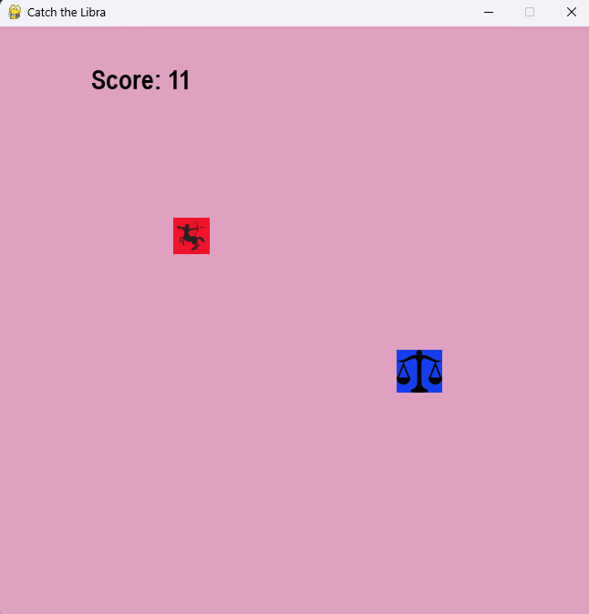
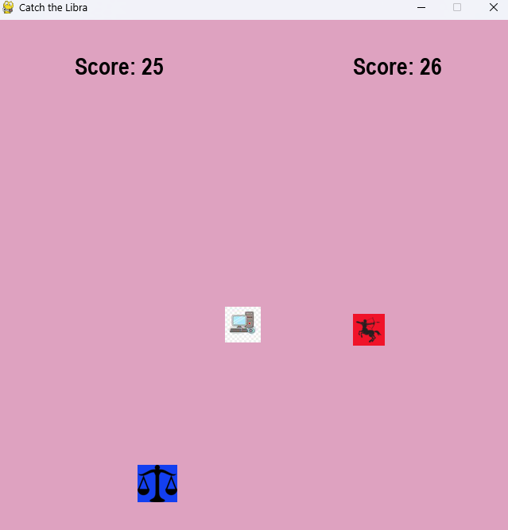

## Catch the Libra

A small python project made with pygame.

## How to play

### Single Player
The player controls the saggitarious character with the **w a s d** keys to chase the libra. Upon catching him, the player earns a score and the libra teleports to a random location in the screen.
 

 
Single player

### Multiplayer
Player 1 controls the sagitarious with the **w a s d** keys to chase the libra. Upon catching him, the player earns a score and the libra teleports to a random location in the screen.
 
Player 2 controls the libra with the arrow keys to get away from the saggitarious and catch the computer icon. Upon catching the computer, player 2 earns a score and the computer teleports to a random location in the screen.
 

 
Multiplayer
  
Thought only a quick and minimal project, the multiplayer mode can be a competitive and intense game between the players. I intend to add more features and improve the gameplay. Once it's ready, I'll be hosting it online for people to try 🙂